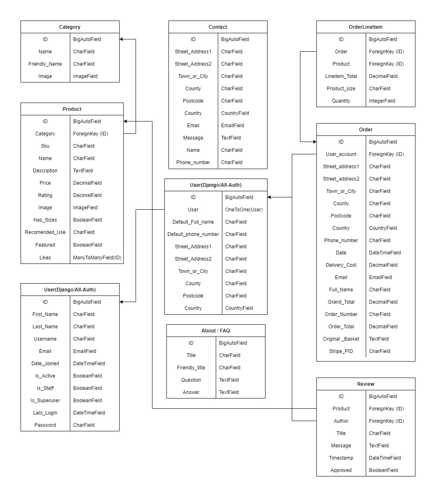
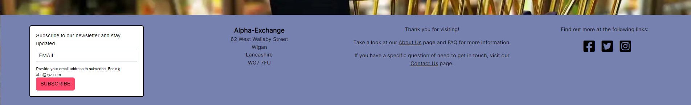
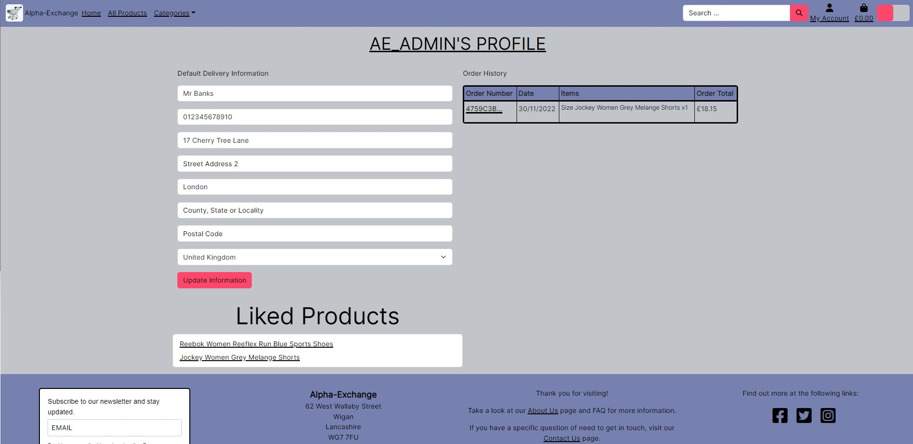

# Alpha-Exchange
(Developer: Benjamin Draper)

 [Live webpage](https://alpha-exchange.herokuapp.com/)

## About
Alpha Exchange is an E-commerce website aimed at B2C sales with a drop shipping style model, this website mainly features clothing, home-wear and accessories. the website is designed to allow users to experience a fully featured shopping experience where you can easily find known products, search for new or similar products, filter by categories or browse through the new arrivals and clearance sections.

### User Information
user information

### Card Information
- Test Card Number: 4242 4242 4242 4242 
- Expiration Date: Any future date (e.g. 02/24) 
- CVC: Any three digits (e.g. 424)

## Table of Content
1. [Project Goals](#project-goals)
    1. [Website User Goals](#website-user-goals)
    2. [Website Owner Goals](#website-owner-goals)
2. [User Experience](#user-experience)
    1. [Target Audience](#target-audience)
    2. [User Requirements and Expectations](#user-requirements-and-expectations)
    3. [Business Model](#business-model)
    4. [SEO](#seo)
    5. [Marketing](#marketing)
3. [User Stories](#user-stories)
4. [Design](#design)
    1. [Design Choices](#design-choices)
    2. [Colour](#colour)
    3. [Fonts](#fonts)
    4. [Structure](#structure)
    5. [Database](#database)
    6. [Wireframes](#wireframes)
5. [Technologies Used](#technologies-used)
    1. [Languages](#languages)
    2. [Frameworks and Tools](#frameworks-and-tools)
    3. [Libraries](#libraries)
6. [Features](#features)
7. [Validation](#validation)
    1. [HTML Validation](#html-validation)
    2. [CSS Validation](#css-validation)
    3. [JavaScript Validation](#javascript-validation)
    4. [Python Validation](#python-validation)
    5. [Accessibility](#accessibility)
    6. [Performance](#performance)
    7. [Device Testing](#device-testing)
    8. [Browser Compatibility](#browser-compatibility)
8. [Testing user stories](#testing-user-stories)
9. [Bugs](#bugs)
10. [Deployment](#deployment)
11. [Credits](#credits)
12. [Acknowledgements](#acknowledgements)

## Project Goals
### Website User Goals
- As a website user, I want to be able to have easy options to navigate around the website.
- As a website user, I want to be able to view the products available on the website.
- As a website user, I want to be able to apply filters to the products.
- As a website user, I want to be able to search for specific products.
- As a website user, I want to be able to contact the site owner if I have any questions.
- As a website user, I want to be able to add items to a basket and checkout my order.
- As a website user, I want to be able to register for an account.
- As a website user, I want to be able to log in and out of my existing account.
- As a website user, I want to be able to review past orders I have made from my account.
- As a website user, I want to be able to sign up to a newsletter.
- As a website user, I want to be able to view and edit my profile.

### Website Owner Goals
- As the website owner, I want to allow users to navigate the website with ease.
- As the website owner, I want to allow users to view the product details.
- As the website owner, I want to allow users to be able to add items to the basket and purchase items.
- As the website owner, I want to allow users to create an account.
- As the website owner, I want to allow users to sign in and out when they return to the website.
- As the website owner, I want to promote the website to new and existing users.
- As the website owner, I want to allow users to see their order history.
- As the website owner, I want to allow users to sign up for a news letter.
- As the website owner, I want to be able to add, edit and delete items from the website myself.

[Back to Table Of Content](#table-of-content)

## User Experience
### Target Audience
- This website is targets people are looking to buy clothing.
- This website is targets people are looking to buy accessories.
- This website is targets people are looking to buy gifts for friends and family.
- This website is targets people are looking to sign up to the newsletter.
- This website is targets people are looking to discover what we currently have to offer.

### User Requirements and Expectations
- The user can expect an intuitive and accessible navigation system.
- The user can expect to easily find the products available.
- The user can expect to easily find specific products they are looking for through filtering and the search function.
- The user can expect all links work as expected and functions perform their tasks correctly.
- The user can expect presentation is in line with the website guidelines and the website is visually appealing on all screen sizes.
- The user can expect easy to read headings to tell the users at a glance what they are looking at.
- The user can expect accessibility features to be clearly defined.
- The user can expect to be able to complete any purchase made and track previous orders through their account.
- The user can expect to be able to contact the business for further queries.

### Business Model
This website is primarily aimed at selling to consumers, for this I have chosen a B2C business model. To make the website more consumer friendly I have made sure that all design decisions, pictures, navigation and ease of purchase is made with the end user in mind.
The business model would be that this website is able to be used as a dropshipping website where the website owner does not need to handle inventory and the products can be sent straight from the supplier.
As an alternative the website owner could buy the product and arrange the shipping of orders themselves, this does mean any returns also get handled by the website owner.
For This project I have chosen for the stock to be handled by a third party.

### SEO
Long tag keywords and short tag keywords were searched for in regards to SEO using Google tools and other online resources. These tags are included within the main HTML head and in the appropriate places within the project to name images and within main body text.

### Marketing
#### Facebook Page
To help market the website, the website includes a like to its own social media page in the footer where new products and announcements are made.
the Facebook page can be viewed [here](). 

#### Newsletter Sign up
The website includes a sign up form to a newsletter so the business can keep in touch with anyone who want more information.

[Back to Table Of Content](#table-of-content)

## User Stories
### Unauthenticated Users
1. As a unauthenticated user, I would like to be able to navigate through the website easily so that it is easy to find the information I am looking for.
2. As a unauthenticated user, I would like to be able to sign up for an account so that I can view my profile and track my orders.
3. As a unauthenticated user, I would like to see the available products that are listed on the website so that I can see what is currently in available.
4. As a unauthenticated user, I would like to know how to find social media links so that I can find out about new products and news.
5. As a unauthenticated user, I would like to be able to search or filter the website for specific products and brands so that I can find exactly what i am looking.
6. As a unauthenticated user, I would like to be able to sort and view products by category so that I can find specific products easily.
7. As a unauthenticated user, I would like to be able to order the products on a page a variety of ways so that I can find what I am looking for easier.
8. As a unauthenticated user, I would like to be able to see detailed description of the products available so that i can make an informed purchase.
9. As a unauthenticated user, I would like to be able to add a product to my basket so that I can purchase them.
10. As a unauthenticated user, I would like to be able to see the products that are in my basket so that I don't spend too much.
11. As a unauthenticated user, I would like to be able to increase and decrease quantities and remove items from my basket so that I don't have to navigate to the store and add the item again each time.
12. As a unauthenticated user, I would like to be able to purchase the items in my basket so that I can complete my order.
13. As a unauthenticated user, I would like to be able to log in to / sign out of an existing account so that I can get updated on my orders.
14. As a unauthenticated user, I would like to be able contact the business so that I can ask any questions.
15. As a unauthenticated user, I would like to be able to sign up to the newsletter so that I can receive news and updates from the business.
### Authenticated Users
16. As a authenticated user, I would like to be able to view and update my personal information so that I do not have to fill it out each time I make an order.
17. As a authenticated user, I would like to be able to view my order history so that i can find products i have ordered before and would order again.
### Website Staff
18. As a website staff user, I would like to be able to use full CRUD functionality so that I can update the product range available.
19. As a website staff user, I would like to be able to manage product inventory so that I can adjust the available products.
20. As a website staff user, I would like to be able to view and update product categories so that the product range is up to date.
21. As a website staff user, I would like to be able to add product categories so that new products are available on the website.
22. As a website staff user, I would like to be able to delete product categories so that products that are no longer available are removed.
### Website Owner
23. As the website owner, I want the products divided into categories so that users looking for something specific can navigate easier.
24. As the website owner, I want the website to act responsively to all device sizes so that the website can be viewed across all devices.
25. As the website owner, I want users to get redirected to custom error pages so that they understand when when something has gone wrong and can be redirected back to the main website.
26. As the website owner, I want users to be able to navigate the website quickly and easily so that they are able to find what they are looking for.
27. As the website owner, I want users to be sign up to a newsletter to capture user information and bring users back to the website.
28. As the website owner, I want users to be able to view the business social media so that users are made aware of the products on offer and kept up to date with any news.
### All Users
29. As a user, I would like to have a confirmation message that my order has been successful so that I am made aware once the transaction has taken place successfully.
30. As a user, I would like to be shown descriptive messages telling me that my actions have been successful or unsuccessful when I preform an action so that I can act accordingly.
31. As a user, I would like to be able to navigate back to the main website structure if an error occurs and I end up on the 404 page so that i can continue shopping without issues.
32. As a user, I would like to be able to find a description of the business and an FAQ section so that I can find the answers I need.

### Agile Methodology

All functionality and development of this project were managed using GitHub which Projects can be found
[here]()

[Back to Table Of Content](#table-of-content)

## Design
### Design Choices
The aim of the design of the website is to create an easy to navigate, clean, modern and responsive design. Any imagery featured on the website is used in a way that promotes the business values and creates a positive response from the user.

### Colour
For the color scheme I have opted to implement a dark and light theme while using colours that compliment the goals and ambitions of the website. To narrow down the choice of colours I used [coolors](https://coolors.co/) an example of both the dark and light theme are shown below.

#### Dark Mode

#### Light Mode

### Fonts
 I am using xxxxxx font with a backup of xxxxxx across the website for the title and headers. This is used to maintain a Consistent and professional look with an easily readable format.

For the Secondary font for the body text the owners decided to use xxxxxx with a backup of xxxxxx, this will help to maintain the consistent theme across the website.

### Structure
The website has been built using a template engine so that all pages follow the same design to maintain the feel across the website.

The Pages are structured in a Regularly used, user friendly and well-known format. This makes each page easy to navigate, coupled with a responsive navbar and footer this gives the user many options for navigating around the website.

The website consists of 15 pages.
1. Home page
2. All products
3. Product details
4. Product categories
5. Log in
6. Log out
7. Register
8. Profile page
9. Basket
10. Contact us
11. About us
12. Admin
13. Add products page
14. Edit products page
15. Error page

### Database
The website was built using Python and the Django framework with a postgres database to store all of our information.

Database Diagram

The following models were created to represent the real database model structure within the website database.

database model list

### Wireframes

Mobile Design

Home page

All products

Product details

Product categories

Log in

Log out

Register

Profile page

Basket

Contact us

About us

Admin

Add products page

Edit products page

Error page

Desktop Design

Home page

All products

Product details

Product categories

Log in

Log out

Register

Profile page

Basket

Contact us

	

About us

Admin

Add products page

Edit products page

Error page

 

[Back to Table Of Content](#table-of-content)

## Technologies Used
### Languages
- [HTML](https://www.w3schools.com/html/default.asp)
- [CSS](https://www.w3schools.com/css/default.asp)
- [JavaScript](https://www.w3schools.com/js/default.asp)
- [Python](https://www.w3schools.com/python/default.asp)

### Frameworks and Tools
- [GitHub](https://github.com/) was used to maintain the version control and store the project remotely
- [Gitpod](https://gitpod.io/) was used to write all the code and to link up with Github to maintain the version control.
- [Balsamiq](https://balsamiq.com/) was use to create the wireframes for the website.
- [Google Fonts](https://fonts.google.com/) was used to pick out the fonts in use across the website.
- [Feather Icons](https://feathericons.com/) was used to create the favicon.
- [Coolors](https://coolors.co/) was used to generate a colour pallette.
- [Am I Responsive?](https://ui.dev/amiresponsive) was used to test the responsive nature of the website design.
- [Bootstrap](https://getbootstrap.com/) was used for the pre-defined components and responsive nature of the layout.
- [Heroku](https://dashboard.heroku.com/) was used to host the website for the additional back-end functionality.
- [Font Awesome](https://fontawesome.com/) - Font awesome was used for the icons on the website social media links.
- [JQuery](https://jquery.com) - JQuery was used in some javascript files for DOM manipulation.
- [W3C HTML Validator](https://validator.w3.org/) was used to validate the HTML
- [W3C CSS Validator](https://jigsaw.w3.org/css-validator/) was used to validate the CSS.
- [WAVE](https://wave.webaim.org/) was used to validate the accessibility of the website.
- [JShint](https://jshint.com/) was used to validate the Javascript.
- [PEP8 Online](http://pep8online.com/) was used to validate the Python.
- [Google Lighthouse](https://developer.chrome.com/docs/lighthouse/overview/) was used to validate the website performance, best practice and SEO.
- [Facebook](https://www.facebook.com) - was used to make a social media marketing page.
- [Stripe](https://stripe.com/gb) - was used to take payments for the website.
- [Amazon Web Services](https://aws.amazon.com/) - was used to host the static files.

### Libraries

[Back to Table Of Content](#table-of-content)

## Features
### Navbar / Dropdown Menu
- Featured on all pages across the website.
- The navbar / dropdown menu is fully responsive and changes to a hamburger style button for smaller screen sizes.
- The navbar / dropdown menu has a link to login or sign up for an account.
- The navbar / dropdown menu includes links to allow users to navigate around the website easily.
- The navbar / dropdown menu includes the dark theme switch toggler option for users that prefer to use a lighter of darker theme.
- user stories covered: 1, 24, 26

Navbar / Dropdown Menu

Navbar / Dropdown Menu Light

Navbar / Dropdown Menu Dark

 

### Footer
- Featured across the whole website.
- The footer contains links to the websites social media handle.
- The footer contains Information on how to get in touch with support when needed.
- The footer is fully responsive down to mobile size devices.
- User stories covered: 1, 4, 14, 15, 24, 27, 28

Footer

 

### Newsletter E-mail List
- Featured across the whole website within the footer.
- The newsletter e-mail list allows users to sign up to a email list so that they can get updates on the products and news about the website.
- User stories covered: 15, 27

Newsletter E-mail List

 

### Contact Us
- The contact us link is featured across the whole website within the footer.
- The contact us page allows users to fill out that sends the team an email with their query.
- User stories covered: 14, 28

Contact Us

 

### About Us
- The about us link is featured across the whole website within the footer.
- The about us page features a description of the website and the business to entice users into buying the products available.
- The about us page also features a FAQ section to answer any regularly asked questions without the need to fill out the contact form.
- User stories covered: 32

About Us

 

### User Registration
- The user registration form allows users to create an account to interact with the community.
- When a user registers for an account they are able to view and edit their profile information.
- When a user registers for an account they are able to view previous orders and the items attached to the order.
- The user registration form is fully responsive down to mobile size devices.
- User stories covered: 2

User Registration

 

### User Login
- The user login form allows users to login to an existing account to interact with the community.
- When a user login for an account they are able to view and edit their profile information.
- When a user login for an account they are able to view previous orders and the items attached to the order.
- The user login form is fully responsive down to mobile size devices.
- User stories covered: 13

User Login

 

### Categories
- The categories are shown on separate a navbar allowing users to filter the products by what category are looking for.
- The categories navbar displays a list of only the current categories, if any are added or removed the list will update.
- User stories covered: 5, 6, 23, 26

Categories

 

### Category Management
- The category management option features in the staff and admin account options.
- The category management allows staff and admins to edit the current categories, add or remove new or old ones.
- User stories covered: 20, 21, 22

Categories

 

### All Products
- The product page is used to display all products that the website has available.
- The product page can be navigate to from the header and is ordered by rating as a default.
- User stories covered: 3, 5, 6, 7

All Products

 

### Product Details
- The product details page is used to display the product details for a specific item.
- The product details page can be navigate to from any item on the store by selecting it.
- User stories covered: 3, 8

Product Details

 

### Page Ordering
- The product pages used to display all products that the website has available can be re-ordered by the user to help them find what they are looking for.
- The product pages can be re-ordered from the dropdown box located on the products page.
- User stories covered: 6, 7

Page Ordering

 

### Create Product
- The create product option features in the staff and admin account options.
- The create product option allows staff and admins to create new products for the store.
- User stories covered: 18, 19

Create Product

 

### Edit Product
- The edit product option features on the products page only for staff and admin users.
- The edit product option allows staff and admins to update the details of the products on the store.
- User stories covered: 18, 19

Edit Product

 

### Delete Product
- The delete product option features on the products page only for staff and admin users.
- The delete product option allows staff and admins to delete the products on the store with confirmation to avoid accidental deletion.
- User stories covered: 18, 19

Delete Product

 

### Product Search
- The product search is used to find specific products that the customer is looking for.
- The product search is part of the header and is featured on all pages of the website.
- The product search works by using keywords to filter the products to what it feels is relevant to the user.
- User stories covered: 1, 3, 5, 6, 7

Product Search

 

### Shopping Basket
- The shopping basket is used to hold a list of products the user is looking to purchase.
- The shopping basket is can be used to adjust quantities and remove products from the basket entirely.
- The shopping basket can be found within the header on every page and links to a separate detailed page with all the items in the basket.
- User stories covered: 9, 10, 11, 12

Shopping Basket

 

### Stripe Checkout
- The stripe checkout page is used to securely handle card information.
- The stripe checkout link is part of the shopping basket page and the user can choose to checkout when ready.
- The stripe checkout page contains a form for users to fill out their payment details.
- The stripe checkout page form is pre-filled for authenticated users who have purchased products on the store before.
- The stripe checkout Page shows a list of the items in the basket and the total cost.
- User stories covered: 12, 16, 29

Stripe Checkout

 

### Profile Page
- The profile page is used to view a users profile information and order history.
- From the profile page a user is able to update their personal details.
- User stories covered: 16, 17

Profile Page

 

### Order History
- From the profile page a user is able to see their order history and select the items they previously ordered.
- The order history includes all the details of the order including the order number, products, cost , delivery and billing information.
- User stories covered: 17

Order History

 

### Website Administration
- The Website Administration page can be used by staff and admin to preform multiple actions and manipulate the database.
- User stories covered: 18, 19, 20, 21, 22

Website Administration

 

