# Alpha-Exchange
(Developer: Benjamin Draper)


[Live webpage](https://alpha-exchange.herokuapp.com/)

## About
Alpha Exchange is an E-commerce website aimed at B2C sales with a drop shipping style model, this website mainly features clothing, home-wear and accessories. the website is designed to allow users to experience a fully featured shopping experience where you can easily find known products, search for new or similar products, filter by categories or browse through the new arrivals and clearance sections.

### User Information
user information

### Card Information
- Test Card Number: 4242 4242 4242 4242 
- Expiration Date: Any future date (e.g. 02/24) 
- CVC: Any three digits (e.g. 424)

## Table of Content
1. [Project Goals](#project-goals)
    1. [Website User Goals](#website-user-goals)
    2. [Website Owner Goals](#website-owner-goals)
2. [User Experience](#user-experience)
    1. [Target Audience](#target-audience)
    2. [User Requirements and Expectations](#user-requirements-and-expectations)
    3. [Business Model](#business-model)
    4. [SEO](#seo)
    5. [Marketing](#marketing)
3. [User Stories](#user-stories)
4. [Design](#design)
    1. [Design Choices](#design-choices)
    2. [Colour](#colour)
    3. [Fonts](#fonts)
    4. [Structure](#structure)
    5. [Database](#database)
    6. [Wireframes](#wireframes)
5. [Technologies Used](#technologies-used)
    1. [Languages](#languages)
    2. [Frameworks and Tools](#frameworks-and-tools)
    3. [Libraries](#libraries)
6. [Features](#features)
7. [Validation](#validation)
    1. [HTML Validation](#html-validation)
    2. [CSS Validation](#css-validation)
    3. [JavaScript Validation](#javascript-validation)
    4. [Python Validation](#python-validation)
    5. [Accessibility](#accessibility)
    6. [Performance](#performance)
    7. [Device Testing](#device-testing)
    8. [Browser Compatibility](#browser-compatibility)
8. [Testing user stories](#testing-user-stories)
9. [Automated Testing](#automated-testing)
10. [Bugs](#bugs)
11. [Google emails](#google-emails)
12. [Stripe](#stripe)
11. [Deployment](#deployment)
13. [Credits](#credits)
13. [Acknowledgements](#acknowledgements)

## Project Goals
### Website User Goals
- As a website user, I want to be able to have easy options to navigate around the website.
- As a website user, I want to be able to view the products available on the website.
- As a website user, I want to be able to apply filters to the products.
- As a website user, I want to be able to search for specific products.
- As a website user, I want to be able to contact the site owner if I have any questions.
- As a website user, I want to be able to add items to a basket and checkout my order.
- As a website user, I want to be able to register for an account.
- As a website user, I want to be able to log in and out of my existing account.
- As a website user, I want to be able to review past orders I have made from my account.
- As a website user, I want to be able to sign up to a newsletter.
- As a website user, I want to be able to view and edit my profile.

### Website Owner Goals
- As the website owner, I want to allow users to navigate the website with ease.
- As the website owner, I want to allow users to view the product details.
- As the website owner, I want to allow users to be able to add items to the basket and purchase items.
- As the website owner, I want to allow users to create an account.
- As the website owner, I want to allow users to sign in and out when they return to the website.
- As the website owner, I want to promote the website to new and existing users.
- As the website owner, I want to allow users to see their order history.
- As the website owner, I want to allow users to sign up for a news letter.
- As the website owner, I want to be able to add, edit and delete items from the website myself.

[Back to Table Of Content](#table-of-content)

## User Experience
### Target Audience
- This website is targets people are looking to buy clothing.
- This website is targets people are looking to buy accessories.
- This website is targets people are looking to buy gifts for friends and family.
- This website is targets people are looking to sign up to the newsletter.
- This website is targets people are looking to discover what we currently have to offer.

### User Requirements and Expectations
- The user can expect an intuitive and accessible navigation system.
- The user can expect to easily find the products available.
- The user can expect to easily find specific products they are looking for through filtering and the search function.
- The user can expect all links work as expected and functions perform their tasks correctly.
- The user can expect presentation is in line with the website guidelines and the website is visually appealing on all screen sizes.
- The user can expect easy to read headings to tell the users at a glance what they are looking at.
- The user can expect accessibility features to be clearly defined.
- The user can expect to be able to complete any purchase made and track previous orders through their account.
- The user can expect to be able to contact the business for further queries.

### Business Model
This website is primarily aimed at selling to consumers, for this I have chosen a B2C business model. To make the website more consumer friendly I have made sure that all design decisions, pictures, navigation and ease of purchase is made with the end user in mind.
The business model would be that this website is able to be used as a dropshipping website where the website owner does not need to handle inventory and the products can be sent straight from the supplier.
As an alternative the website owner could buy the product and arrange the shipping of orders themselves, this does mean any returns also get handled by the website owner.
For This project I have chosen for the stock to be handled by a third party.

### SEO
Long tag keywords and short tag keywords were searched for in regards to SEO using Google tools and other online resources. These tags are included within the main HTML head and in the appropriate places within the project to name images and within main body text.


### Marketing
#### Facebook Page
To help market the website, the website includes a like to its own social media page in the footer where new products and announcements are made.
the Facebook page can be viewed [here](). 


#### Newsletter Sign up
The website includes a sign up form to a newsletter so the business can keep in touch with anyone who want more information.


[Back to Table Of Content](#table-of-content)

## User Stories
### Unauthenticated Users
1. As a unauthenticated user, I would like to be able to navigate through the website easily so that it is easy to find the information I am looking for.
2. As a unauthenticated user, I would like to be able to sign up for an account so that I can view my profile and track my orders.
3. As a unauthenticated user, I would like to see the available products that are listed on the website so that I can see what is currently in available.
4. As a unauthenticated user, I would like to know how to find social media links so that I can find out about new products and news.
5. As a unauthenticated user, I would like to be able to search or filter the website for specific products and brands so that I can find exactly what i am looking.
6. As a unauthenticated user, I would like to be able to sort and view products by category so that I can find specific products easily.
7. As a unauthenticated user, I would like to be able to order the products on a page a variety of ways so that I can find what I am looking for easier.
8. As a unauthenticated user, I would like to be able to see detailed description of the products available so that i can make an informed purchase.
9. As a unauthenticated user, I would like to be able to add a product to my basket so that I can purchase them.
10. As a unauthenticated user, I would like to be able to see the products that are in my basket so that I don't spend too much.
11. As a unauthenticated user, I would like to be able to increase and decrease quantities and remove items from my basket so that I don't have to navigate to the store and add the item again each time.
12. As a unauthenticated user, I would like to be able to purchase the items in my basket so that I can complete my order.
13. As a unauthenticated user, I would like to be able to log in to / sign out of an existing account so that I can get updated on my orders.
14. As a unauthenticated user, I would like to be able contact the business so that I can ask any questions.
15. As a unauthenticated user, I would like to be able to sign up to the newsletter so that I can receive news and updates from the business.
### Authenticated Users
16. As a authenticated user, I would like to be able to view and update my personal information so that I do not have to fill it out each time I make an order.
17. As a authenticated user, I would like to be able to view my order history so that i can find products i have ordered before and would order again.
### Website Staff
18. As a website staff user, I would like to be able to use full CRUD functionality so that I can update the product range available.
19. As a website staff user, I would like to be able to manage product inventory so that I can adjust the available products.
20. As a website staff user, I would like to be able to view and update product categories so that the product range is up to date.
21. As a website staff user, I would like to be able to add product categories so that new products are available on the website.
22. As a website staff user, I would like to be able to delete product categories so that products that are no longer available are removed.
### Website Owner
23. As the website owner, I want the products divided into categories so that users looking for something specific can navigate easier.
24. As the website owner, I want the website to act responsively to all device sizes so that the website can be viewed across all devices.
25. As the website owner, I want users to get redirected to custom error pages so that they understand when when something has gone wrong and can be redirected back to the main website.
26. As the website owner, I want users to be able to navigate the website quickly and easily so that they are able to find what they are looking for.
27. As the website owner, I want users to be sign up to a newsletter to capture user information and bring users back to the website.
28. As the website owner, I want users to be able to view the business social media so that users are made aware of the products on offer and kept up to date with any news.
### All Users
29. As a user, I would like to have a confirmation message that my order has been successful so that I am made aware once the transaction has taken place successfully.
30. As a user, I would like to be shown descriptive messages telling me that my actions have been successful or unsuccessful when I preform an action so that I can act accordingly.
31. As a user, I would like to be able to navigate back to the main website structure if an error occurs and I end up on the 404 page so that i can continue shopping without issues.
32. As a user, I would like to be able to find a description of the business and an FAQ section so that I can find the answers I need.

### Agile Methodology

All functionality and development of this project were managed using GitHub which Projects can be found
[here](https://github.com/users/benjamindraper1996/projects/5/views/1)

[Back to Table Of Content](#table-of-content)

## Design
### Design Choices
The aim of the design of the website is to create an easy to navigate, clean, modern and responsive design. Any imagery featured on the website is used in a way that promotes the business values and creates a positive response from the user.

### Colour
For the color scheme I have opted to implement a dark and light theme while using colours that compliment the goals and ambitions of the website. To narrow down the choice of colours I used [coolors](https://coolors.co/) an example of both the dark and light theme are shown below.

#### Dark Mode

#### Light Mode


### Fonts
I am using Inter font with a backup of sans-serif across the website. This is used to maintain a Consistent and professional look with an easily readable format.

### Structure
The website has been built using a template engine so that all pages follow the same design to maintain the feel across the website.

The Pages are structured in a Regularly used, user friendly and well-known format. This makes each page easy to navigate, coupled with a responsive navbar and footer this gives the user many options for navigating around the website.

The website consists of 15 pages.
1. Home page
2. All products
3. Product details
4. Product categories
5. Log in
6. Log out
7. Register
8. Profile page
9. Basket
10. Contact us
11. About us
12. Admin
13. Add products page
14. Edit products page
15. Error page

### Database
The website was built using Python and the Django framework with a postgres database to store all of our information.
<details><summary>Database Diagram</summary>

</details>

The following models were created to represent the real database model structure within the website database.

database model list

### Wireframes
<details><summary>Mobile Design</summary>
<details><summary>Home page</summary>

</details>
<details><summary>All products</summary>

</details>
<details><summary>Product details</summary>

</details>
<details><summary>Product categories</summary>

</details>
<details><summary>Log in</summary>

</details>
<details><summary>Log out</summary>

</details>
<details><summary>Register</summary>

</details>
<details><summary>Profile page</summary>

</details>
<details><summary>Basket</summary>

</details>
<details><summary>Contact us</summary>

</details>
<details><summary>About us</summary>

</details>
<details><summary>Admin</summary>

</details>
<details><summary>Add products page</summary>

</details>
<details><summary>Edit products page</summary>

</details>
<details><summary>Error page</summary>

</details>
</details>

<details><summary>Desktop Design</summary>
<details><summary>Home page</summary>

</details>
<details><summary>All products</summary>

</details>
<details><summary>Product details</summary>

</details>
<details><summary>Product categories</summary>

</details>
<details><summary>Log in</summary>

</details>
<details><summary>Log out</summary>

</details>
<details><summary>Register</summary>

</details>
<details><summary>Profile page</summary>

</details>
<details><summary>Basket</summary>

</details>
<details><summary>Contact us</summary>
	
</details>
<details><summary>About us</summary>

</details>
<details><summary>Admin</summary>

</details>
<details><summary>Add products page</summary>

</details>
<details><summary>Edit products page</summary>

</details>
<details><summary>Error page</summary>

</details>
</details>
<br>

[Back to Table Of Content](#table-of-content)

## Technologies Used
### Languages
- [HTML](https://www.w3schools.com/html/default.asp)
- [CSS](https://www.w3schools.com/css/default.asp)
- [JavaScript](https://www.w3schools.com/js/default.asp)
- [Python](https://www.w3schools.com/python/default.asp)

### Frameworks and Tools
- [GitHub](https://github.com/) was used to maintain the version control and store the project remotely
- [Gitpod](https://gitpod.io/) was used to write all the code and to link up with Github to maintain the version control.
- [Balsamiq](https://balsamiq.com/) was use to create the wireframes for the website.
- [Google Fonts](https://fonts.google.com/) was used to pick out the fonts in use across the website.
- [Feather Icons](https://feathericons.com/) was used to select the favicon from their database.
- [Favicon](https://favicon.io/) was used to convert the raw svg file into a useable favicon image.
- [Coolors](https://coolors.co/) was used to generate a colour pallette.
- [Am I Responsive?](https://ui.dev/amiresponsive) was used to test the responsive nature of the website design.
- [Bootstrap](https://getbootstrap.com/) was used for the pre-defined components and responsive nature of the layout.
- [Heroku](https://dashboard.heroku.com/) was used to host the website for the additional back-end functionality.
- [Font Awesome](https://fontawesome.com/) - Font awesome was used for the icons on the website social media links.
- [JQuery](https://jquery.com) - JQuery was used in some javascript files for DOM manipulation.
- [W3C HTML Validator](https://validator.w3.org/) was used to validate the HTML
- [W3C CSS Validator](https://jigsaw.w3.org/css-validator/) was used to validate the CSS.
- [WAVE](https://wave.webaim.org/) was used to validate the accessibility of the website.
- [JShint](https://jshint.com/) was used to validate the Javascript.
- [PEP8 Online](http://pep8online.com/) was used to validate the Python.
- [Google Lighthouse](https://developer.chrome.com/docs/lighthouse/overview/) was used to validate the website performance, best practice and SEO.
- [Facebook](https://www.facebook.com) - was used to make a social media marketing page.
- [Stripe](https://stripe.com/gb) - was used to take payments for the website.
- [Amazon Web Services](https://aws.amazon.com/) - was used to host the static files.

### Libraries


[Back to Table Of Content](#table-of-content)

## Features
### Navbar / Dropdown Menu
- Featured on all pages across the website.
- The navbar / dropdown menu is fully responsive and changes to a hamburger style button for smaller screen sizes.
- The navbar / dropdown menu has a link to login or sign up for an account.
- The navbar / dropdown menu includes links to allow users to navigate around the website easily.
- The navbar / dropdown menu includes the dark theme switch toggler option for users that prefer to use a lighter of darker theme.
- user stories covered: 1, 24, 26
<details><summary>Navbar / Dropdown Menu</summary>

</details>
<details><summary>Navbar / Dropdown Menu Light</summary>

</details>
<details><summary>Navbar / Dropdown Menu Dark</summary>

</details>
<br>

### Footer
- Featured across the whole website.
- The footer contains links to the websites social media handle.
- The footer contains Information on how to get in touch with support when needed.
- The footer is fully responsive down to mobile size devices.
- User stories covered: 1, 4, 14, 15, 24, 27, 28
<details><summary>Footer</summary>

</details>
<br>

### Newsletter E-mail List
- Featured across the whole website within the footer.
- The newsletter e-mail list allows users to sign up to a email list so that they can get updates on the products and news about the website.
- User stories covered: 15, 27
<details><summary>Newsletter E-mail List</summary>

</details>
<br>

### Contact Us
- The contact us link is featured across the whole website within the navbar.
- The contact us page allows users to fill out that sends the team an email with their query.
- User stories covered: 14, 28
<details><summary>Contact Us</summary>

</details>
<br>

### About Us
- The about us link is featured across the whole website within the footer.
- The about us page features a description of the website and the business to entice users into buying the products available.
- The about us page also features a FAQ section to answer any regularly asked questions without the need to fill out the contact form.
- User stories covered: 32
<details><summary>About Us</summary>

</details>
<br>

### User Registration
- The user registration form allows users to create an account to interact with the community.
- When a user registers for an account they are able to view and edit their profile information.
- When a user registers for an account they are able to view previous orders and the items attached to the order.
- The user registration form is fully responsive down to mobile size devices.
- User stories covered: 2
<details><summary>User Registration</summary>

</details>
<br>

### User Login
- The user login form allows users to login to an existing account to interact with the community.
- When a user login for an account they are able to view and edit their profile information.
- When a user login for an account they are able to view previous orders and the items attached to the order.
- The user login form is fully responsive down to mobile size devices.
- User stories covered: 13
<details><summary>User Login</summary>

</details>
<br>

### Categories
- The categories are shown on separate a navbar allowing users to filter the products by what category are looking for.
- The categories navbar displays a list of only the current categories, if any are added or removed the list will update.
- User stories covered: 5, 6, 23, 26
<details><summary>Categories</summary>

</details>
<br>

### Category Management
- The category management option features in the staff and admin account options.
- The category management allows staff and admins to edit the current categories, add or remove new or old ones.
- User stories covered: 20, 21, 22
<details><summary>Categories</summary>

</details>
<br>

### All Products
- The product page is used to display all products that the website has available.
- The product page can be navigate to from the header and is ordered by rating as a default.
- User stories covered: 3, 5, 6, 7
<details><summary>All Products</summary>

</details>
<br>

### Product Details
- The product details page is used to display the product details for a specific item.
- The product details page can be navigate to from any item on the store by selecting it.
- User stories covered: 3, 8
<details><summary>Product Details</summary>

</details>
<br>

### Page Ordering
- The product pages used to display all products that the website has available can be re-ordered by the user to help them find what they are looking for.
- The product pages can be re-ordered from the dropdown box located on the products page.
- User stories covered: 6, 7
<details><summary>Page Ordering</summary>

</details>
<br>

### Create Product
- The create product option features in the staff and admin account options.
- The create product option allows staff and admins to create new products for the store.
- User stories covered: 18, 19
<details><summary>Create Product</summary>

</details>
<br>

### Edit Product
- The edit product option features on the products page only for staff and admin users.
- The edit product option allows staff and admins to update the details of the products on the store.
- User stories covered: 18, 19
<details><summary>Edit Product</summary>

</details>
<br>

### Delete Product
- The delete product option features on the products page only for staff and admin users.
- The delete product option allows staff and admins to delete the products on the store with confirmation to avoid accidental deletion.
- User stories covered: 18, 19
<details><summary>Delete Product</summary>

</details>
<br>

### Product Search
- The product search is used to find specific products that the customer is looking for.
- The product search is part of the header and is featured on all pages of the website.
- The product search works by using keywords to filter the products to what it feels is relevant to the user.
- User stories covered: 1, 3, 5, 6, 7
<details><summary>Product Search</summary>

</details>
<br>

### Shopping Basket
- The shopping basket is used to hold a list of products the user is looking to purchase.
- The shopping basket is can be used to adjust quantities and remove products from the basket entirely.
- The shopping basket can be found within the header on every page and links to a separate detailed page with all the items in the basket.
- User stories covered: 9, 10, 11, 12
<details><summary>Shopping Basket</summary>

</details>
<br>

### Stripe Checkout
- The stripe checkout page is used to securely handle card information.
- The stripe checkout link is part of the shopping basket page and the user can choose to checkout when ready.
- The stripe checkout page contains a form for users to fill out their payment details.
- The stripe checkout page form is pre-filled for authenticated users who have purchased products on the store before.
- The stripe checkout Page shows a list of the items in the basket and the total cost.
- User stories covered: 12, 16, 29
<details><summary>Stripe Checkout</summary>

</details>
<br>

### Profile Page
- The profile page is used to view a users profile information and order history.
- From the profile page a user is able to update their personal details.
- User stories covered: 16, 17
<details><summary>Profile Page</summary>

</details>
<br>

### Order History
- From the profile page a user is able to see their order history and select the items they previously ordered.
- The order history includes all the details of the order including the order number, products, cost , delivery and billing information.
- User stories covered: 17
<details><summary>Order History</summary>

</details>
<br>

### Website Administration
- The Website Administration page can be used by staff and admin to preform multiple actions and manipulate the database.
- User stories covered: 18, 19, 20, 21, 22
<details><summary>Website Administration</summary>

</details>
<br>

### Message Popups
- The message popups feature is used to inform the user when a specified action has taken place and the action was applied.
- The message popups feature is used to inform the user when an error has happens and that the action has not been applied.
- The message popups feature is located in the top right corner of the screen and is closed manually by the user or on a new page load.
- User stories covered: 29, 30
<details><summary>Message Popups</summary>

</details>
<br>

### Error Pages
- The custom Error pages are used to replace the standard error pages from django.
- The custom Error pages cover 400, 404, 403, 500 errors.
- The featured recipes list is fully responsive down to mobile size devices.
- User stories covered: 1, 25, 26, 31
<details><summary>Error Pages</summary>

</details>
<br>

[Back to Table Of Content](#table-of-content)

## Validation
### HTML Validation
I used the W3C Validation Service to validate the HTML of the website.
All pages passed with no errors, these were run as web pages to combines the parts of the template into completed versions for the browser, with the exception of the error pages which would not be recognized by W3C.
<details><summary>Home page</summary>

</details>
<details><summary>All products</summary>

</details>
<details><summary>Product details</summary>

</details>
<details><summary>Product categories</summary>
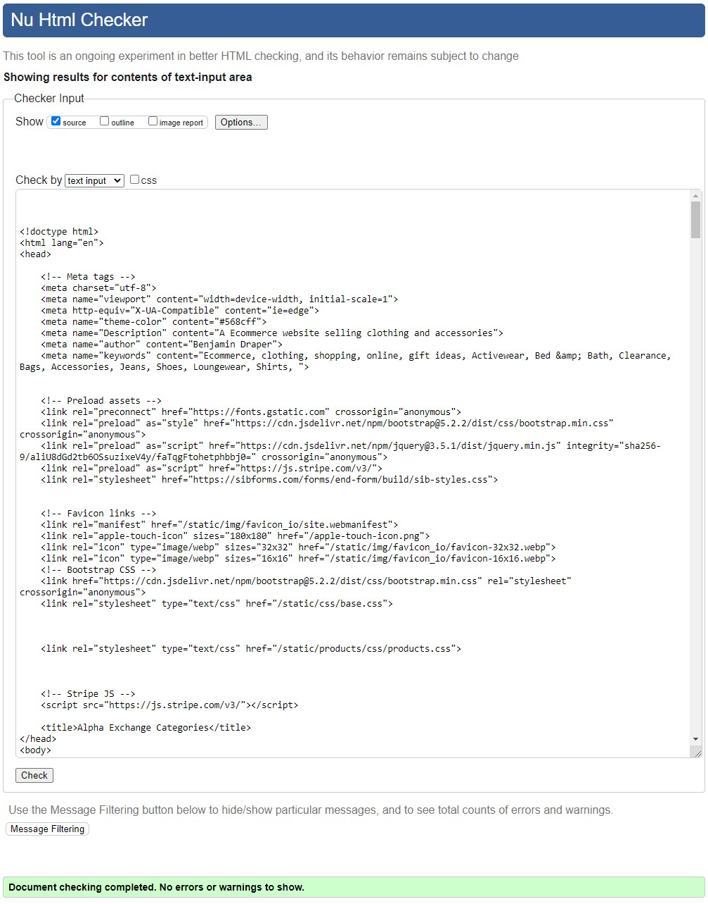
</details>
<details><summary>Log in</summary>

</details>
<details><summary>Log out</summary>

</details>
<details><summary>Register</summary>

</details>
<details><summary>Profile page</summary>

</details>
<details><summary>Basket</summary>
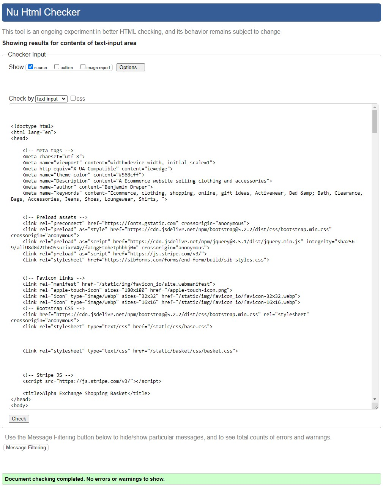
</details>
<details><summary>Contact us</summary>

</details>
<details><summary>About us</summary>

</details>
<details><summary>Admin</summary>

</details>
<details><summary>Add products page</summary>

</details>
<details><summary>Edit products page</summary>

</details>
<details><summary>Error page</summary>

</details>
<br>

### CSS Validation
I used the W3C Jigsaw CSS Validation Service to validate the CSS of the website.
My CSS passed with no errors and warnings to show.
<details><summary>Base CSS</summary>

</details>
<details><summary>Products CSS</summary>

</details>
<br>

### JavaScript Validation
JSHint Static Code Analysis Tool for JavaScript was used to validate the Javascript file.
All files with no errors or warnings.
<details><summary>Theme Switch</summary>

</details>
<br>

### Python Validation
I used the PEP8 Validation Service to validate the python code for the website.
My code passed with no errors and warnings to show.

<details><summary>Recipe App</summary>

<details><summary>admin.py</summary>

</details>

</details>

<details><summary>Home App</summary>

<details><summary>admin.py</summary>

</details>

</details>

<details><summary>Products App</summary>

<details><summary>admin.py</summary>

</details>

</details>
<br>

### Accessibility
I used WAVE WebAIM web accessibility evaluation tool to ensure the website met high accessibility standards. All pages passed with no errors, the profile page had to be run through the web extension as it would normally require a user to be logged in to an account and the standard API was not able to work around this.
<details><summary>Home page</summary>

</details>
<details><summary>All products</summary>

</details>
<details><summary>Product details</summary>

</details>
<details><summary>Product categories</summary>

</details>
<details><summary>Log in</summary>

</details>
<details><summary>Log out</summary>

</details>
<details><summary>Register</summary>

</details>
<details><summary>Profile page</summary>

</details>
<details><summary>Basket</summary>

</details>
<details><summary>Contact us</summary>

</details>
<details><summary>About us</summary>

</details>
<details><summary>Admin</summary>

</details>
<details><summary>Add products page</summary>

</details>
<details><summary>Edit products page</summary>

</details>
<details><summary>Error page</summary>

</details>
<br>

### Performance
Google Lighthouse in Google Chrome Developer Tools was used to test the performance of the website. 
<details><summary>Home page</summary>

</details>
<details><summary>All products</summary>

</details>
<details><summary>Product details</summary>

</details>
<details><summary>Product categories</summary>

</details>
<details><summary>Log in</summary>

</details>
<details><summary>Log out</summary>

</details>
<details><summary>Register</summary>

</details>
<details><summary>Profile page</summary>

</details>
<details><summary>Basket</summary>
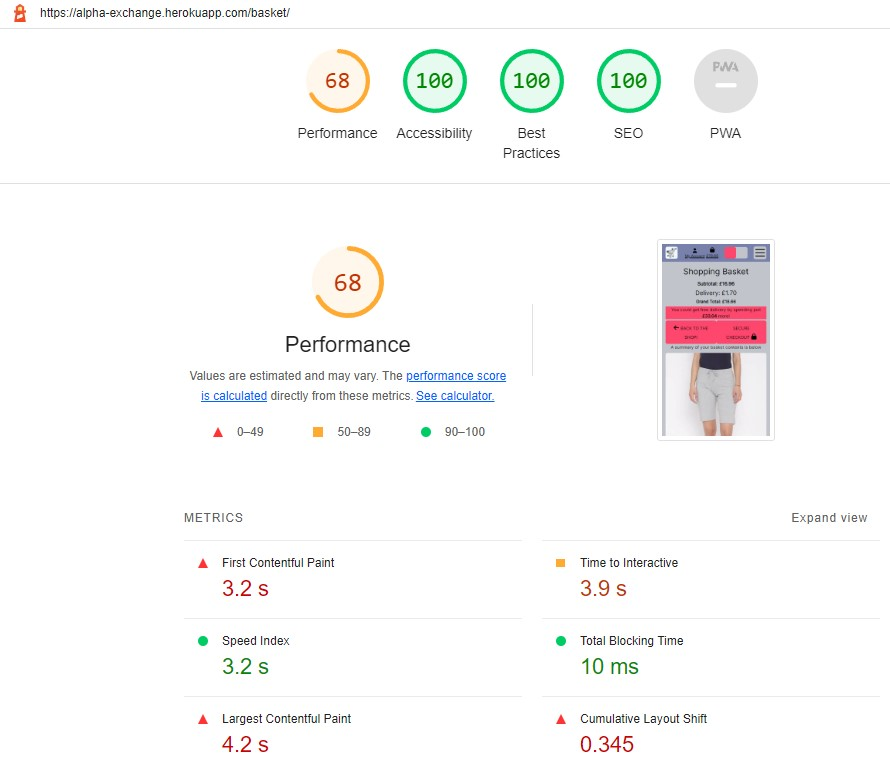
</details>
<details><summary>Contact us</summary>

</details>
<details><summary>About us</summary>

</details>
<details><summary>Admin</summary>

</details>
<details><summary>Add products page</summary>

</details>
<details><summary>Edit products page</summary>

</details>
<details><summary>Error page</summary>

</details>
<br>

### Device Testing
The website was tested on the following devices:
- Huawei Matebook D15
- MacBook Pro 13” 2019
- Samsung Galaxy S22 Plus
- Samsung Galaxy S20 FE 5G
In addition, the website was tested using Google Chrome Developer Tools Device Toggling option for all available device options.

### Browser Compatibility
The website was tested on the following browsers in both regular and incognito modes:
- Google Chrome
- Mozilla Firefox
- Microsoft Edge

## Testing user stories
1. As a unauthenticated user, I would like to be able to navigate through the website easily so that it is easy to find the information I am looking for.

| **Feature** | **Action** | **Expected Result** | **Actual Result** |
|-------------|------------|---------------------|-------------------|
| Navbar / Dropdown Menu | Use the Navbar to navigate to the contact us page | The contact us page loads correctly and the user can fill in the form | Works As Expected |
| Product Search | Use the search bar within the header to search for the name, recommended use or a keyword of a product | The user is redirected to a page with the search results | Works As Expected |
| Error Pages | Edit the website URL from any page to form an invalid URL. On the error page use the built in navigation to navigate back to the main website. | The user is redirected to a custom error page and is able to navigate on their own back to the main website. | Works As Expected |
|  |  |  |  |
<details><summary>Screenshots</summary>

</details>
<br>

2. As a unauthenticated user, I would like to be able to sign up for an account so that I can view my profile and track my orders.

| **Feature** | **Action** | **Expected Result** | **Actual Result** |
|-------------|------------|---------------------|-------------------|
| User Registration | Fill out the User Registration form to create an account | A user account is created for the user and redirected to the profile page | Works As Expected |
|  |  |  |  |
<details><summary>Screenshots</summary>

</details>
<br>

3. As a unauthenticated user, I would like to see the available products that are listed on the website so that I can see what is currently in available.

| **Feature** | **Action** | **Expected Result** | **Actual Result** |
|-------------|------------|---------------------|-------------------|
| All Products | From any page of the website use the link in the header to navigate to the products page | The user is taken to the all products page | Works As Expected |
| Product Details | From any product page or category page select a product on the store | The user is redirected to the product details page | Works As Expected |
| Product Search | Use the search bar within the header to search for the name, recommended use or a keyword of a product | The user is redirected to a page with the search results | Works As Expected |
|  |  |  |  |
<details><summary>Screenshots</summary>

</details>
<br>

4. As a unauthenticated user, I would like to know how to find social media links so that I can find out about new products and news.

| **Feature** | **Action** | **Expected Result** | **Actual Result** |
|-------------|------------|---------------------|-------------------|
| Footer | From any page on the website, scroll to the bottom of the page, locate and use the social media handle within the website footer | The user is redirected to the website social media page, opening in a new tab. | Works As Expected |
|  |  |  |  |
<details><summary>Screenshots</summary>

</details>
<br>

5. As a unauthenticated user, I would like to be able to search or filter the website for specific products and brands so that I can find exactly what i am looking.

| **Feature** | **Action** | **Expected Result** | **Actual Result** |
|-------------|------------|---------------------|-------------------|
| Categories | From any page of the website use one of the links in the header to navigate to the selected category page | The user is taken to the selected category page | Works As Expected |
| All Products | From any page of the website use the link in the header to navigate to the products page | The user is taken to the all products page | Works As Expected |
| Product Search | Use the search bar within the header to search for the name, recommended use or a keyword of a product | The user is redirected to a page with the search results | Works As Expected |
|  |  |  |  |
<details><summary>Screenshots</summary>

</details>
<br>

6. As a unauthenticated user, I would like to be able to sort and view products by category so that I can find specific products easily.

| **Feature** | **Action** | **Expected Result** | **Actual Result** |
|-------------|------------|---------------------|-------------------|
| Categories | From any page of the website use one of the links in the header to navigate to the selected category page | The user is taken to the selected category page | Works As Expected |
| All Products | From any page of the website use the link in the header to navigate to the products page | The user is taken to the all products page | Works As Expected |
| Page Ordering | From any page containing a list of products use the dropdown box to change how the page is ordered. | The products on the page are re-ordered by the new selection | Works As Expected |
| Product Search | Use the search bar within the header to search for the name, recommended use or a keyword of a product | The user is redirected to a page with the search results | Works As Expected |
|  |  |  |  |
<details><summary>Screenshots</summary>

</details>
<br>

7. As a unauthenticated user, I would like to be able to order the products on a page a variety of ways so that I can find what I am looking for easier.

| **Feature** | **Action** | **Expected Result** | **Actual Result** |
|-------------|------------|---------------------|-------------------|
| All Products | From the all products page use the dropdown box to change how the page is ordered. | The products on the page are re-ordered by the new selection | Works As Expected |
| Page Ordering | From any page containing a list of products use the dropdown box to change how the page is ordered. | The products on the page are re-ordered by the new selection | Works As Expected |
| Product Search | From the search results page use the dropdown box to change how the page is ordered. | The products on the page are re-ordered by the new selection | Works As Expected |
|  |  |  |  |
<details><summary>Screenshots</summary>

</details>
<br>

8. As a unauthenticated user, I would like to be able to see detailed description of the products available so that i can make an informed purchase.

| **Feature** | **Action** | **Expected Result** | **Actual Result** |
|-------------|------------|---------------------|-------------------|
| Product Details | From any page containing a list of products select a product to view | The user is redirected to a product details page containing all the product information | Works As Expected |
|  |  |  |  |
<details><summary>Screenshots</summary>

</details>
<br>

9. As a unauthenticated user, I would like to be able to add a product to my basket so that I can purchase them.

| **Feature** | **Action** | **Expected Result** | **Actual Result** |
|-------------|------------|---------------------|-------------------|
| Shopping Basket | From any page containing a list of products hover over any item you want to purchase and select the "Add To Basket" button | The item is added to the basket | Works As Expected |
| Shopping Basket | From the products detail page select the "Add To Basket" button | The item is added to the basket | Works As Expected |
|  |  |  |  |
<details><summary>Screenshots</summary>

</details>
<br>

10. As a unauthenticated user, I would like to be able to see the products that are in my basket so that I don't spend too much.

| **Feature** | **Action** | **Expected Result** | **Actual Result** |
|-------------|------------|---------------------|-------------------|
| Shopping Basket | From any page, select the basket icon on the navbar to navigate to the shopping basket page | View the items in the shopping basket. | Works As Expected |
|  |  |  |  |
<details><summary>Screenshots</summary>

</details>
<br>

11. As a unauthenticated user, I would like to be able to increase or decrease quantities and remove items from my basket so that I don't have to navigate to the store and add the item again each time.

| **Feature** | **Action** | **Expected Result** | **Actual Result** |
|-------------|------------|---------------------|-------------------|
| Shopping Basket | From any page, select the basket icon on the navbar to navigate to the shopping basket page and select the increase or decrease buttons next to the product. | The quantity of the product in the basket is adjusted. | Works As Expected |
|  |  |  |  |
<details><summary>Screenshots</summary>
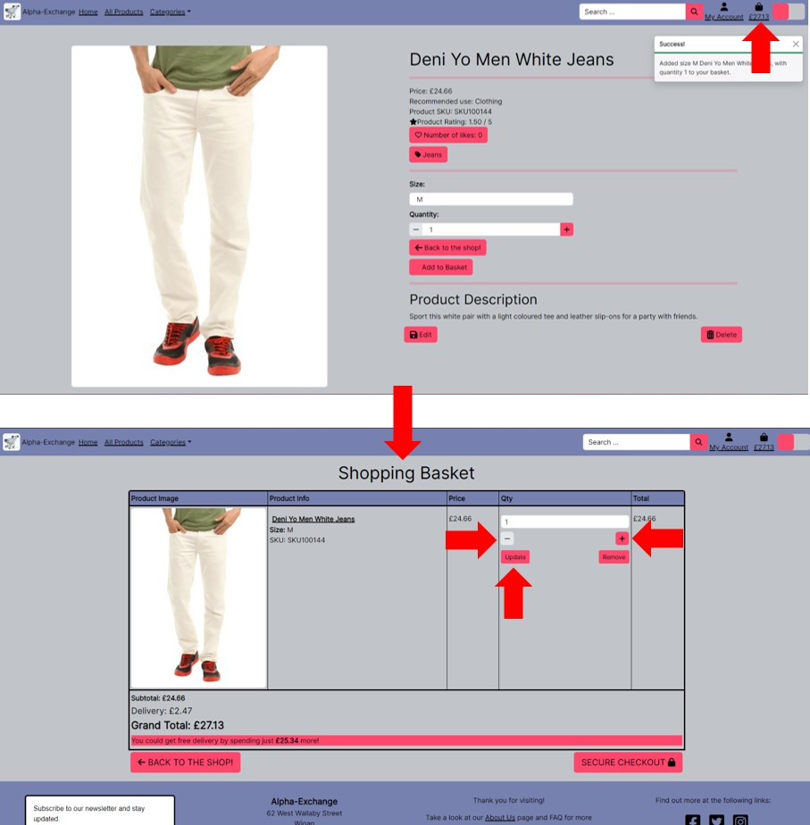
</details>
<br>

12. As a unauthenticated user, I would like to be able to purchase the items in my basket so that I can complete my order.

| **Feature** | **Action** | **Expected Result** | **Actual Result** |
|-------------|------------|---------------------|-------------------|
| Shopping Basket | From the Shopping basket page, once the user is happy with their order, select the checkout option and filling their details | The user is redirected to the checkout page where they can fill out the checkout details and purchase their products. | Works As Expected |
| Stripe Checkout | On the checkout page the user should fill out their details to finish the purchase of the items in the current basket | The user purchases the items they placed into the basket | Works As Expected |
|  |  |  |  |
<details><summary>Screenshots</summary>

</details>
<br>

13. As a unauthenticated user, I would like to be able to log in to / sign out of an existing account so that I can get updated on my orders.

| **Feature** | **Action** | **Expected Result** | **Actual Result** |
|-------------|------------|---------------------|-------------------|
| User Login | From any page of the website use the login link within the accounts section on the navbar and fill out the login form. | The user is redirected to the login page and once the form is filled out they are logged into the website. | Works As Expected |
|  |  |  |  |
<details><summary>Screenshots</summary>

</details>
<br>

14. As a unauthenticated user, I would like to be able contact the business so that I can ask any questions or make a complaint.

| **Feature** | **Action** | **Expected Result** | **Actual Result** |
|-------------|------------|---------------------|-------------------|
| Footer | From any page on the website, scroll to the bottom of the page, locate the contact us section | The user is presented with a form to fill out that emails the admin team with their issues | Works As Expected |
| Contact Us | From any page on the website, use the navbar to navigate to the contact us page | The user is presented with a form to fill out that emails the admin team with their issues | Works As Expected |
|  |  |  |  |
<details><summary>Screenshots</summary>

</details>
<br>


15. As a unauthenticated user, I would like to be able to sign up to the newsletter so that I can receive news and updates from the business.

| **Feature** | **Action** | **Expected Result** | **Actual Result** |
|-------------|------------|---------------------|-------------------|
| Footer | From any page on the website, scroll to the bottom of the page, locate the newsletter sign up section. | The user is signed up for the email marketing and newsletters. | Works As Expected |
| Newsletter E-mail List | From any page on the website, scroll to the bottom of the page, locate the newsletter sign up section. | The user is signed up for the email marketing and newsletters. | Works As Expected |
|  |  |  |  |
<details><summary>Screenshots</summary>
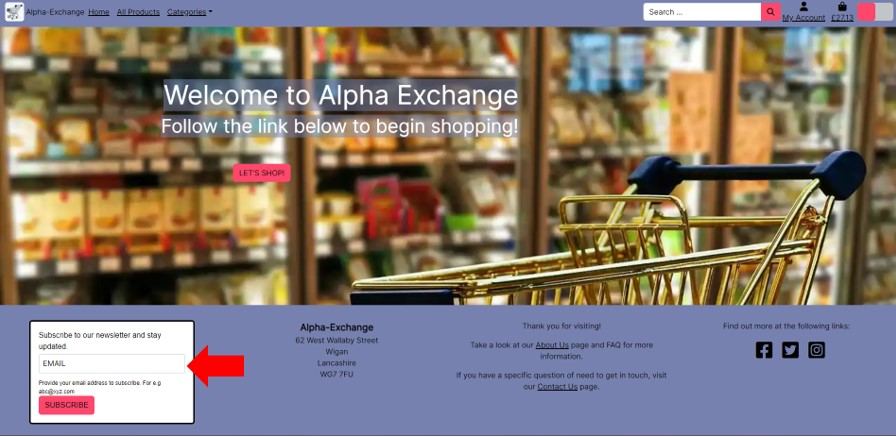
</details>
<br>

16. As a authenticated user, I would like to be able to view and update my personal information so that I do not have to fill it out each time I make an order.

| **Feature** | **Action** | **Expected Result** | **Actual Result** |
|-------------|------------|---------------------|-------------------|
| Stripe Checkout | When a user makes an order there is a checkbox to save the information for the next time, if this box is checked the details currently filled out will be saved to the user profile and appear on the profile page. | the details filled out on the checkout page appear on the profile page  | Works As Expected |
| Profile Page | From the profile page, update the form with the new personal information and click the update button | the form saves and the page reloads with the new information saved in the database and displayed in teh form | Works As Expected |
|  |  |  |  |
<details><summary>Screenshots</summary>

</details>
<br>

17. As a authenticated user, I would like to be able to view my order history so that i can find products i have ordered before and would order again.

| **Feature** | **Action** | **Expected Result** | **Actual Result** |
|-------------|------------|---------------------|-------------------|
| Profile Page | From any page use the profile page link within the accounts section on the navbar to navigate to the profile page | On the profile page see a list of previous orders and the products ont he orders | Works As Expected |
| Order History | On the profile page locate the order history, click on an order to open up a detailed view of the items, quantity and more information relating to the order. | The user is redirected to a new page with detailed information relating to the the order selected. | Works As Expected |
|  |  |  |  |
<details><summary>Screenshots</summary>

</details>
<br>

18. As a website staff user, I would like to be able to use full CRUD functionality so that I can update the product range available.

| **Feature** | **Action** | **Expected Result** | **Actual Result** |
|-------------|------------|---------------------|-------------------|
| Create Product | When logged in as website staff, use the accounts section on the navbar to navigate to the create a product page, from here fill out the details for the new product. | When the staff member clicks the link to create a new product the staff member is redirected to a new page with a form for creating products, once the form is filled out and submitted a new product is created | Works As Expected |
| Edit Product | When signed in as a staff member and from any page containing a list of products select the link underneath any product to edit the product | the staff member is redirected to the edit product page where there is a form pre-populated with the current information for the staff member to update and resubmit | Works As Expected |
| Delete Product | When signed in as a staff member and from any page containing a list of products select the link underneath any product to delete the product | The selected product is deleted from the database. | Works As Expected |
| Website Administration | When signed in as a admin, navigate to the admin page from the navbar link | From the admin panel the Admin user is able to perform bulk actions and full CRUD functionality. | Works As Expected |
|  |  |  |  |
<details><summary>Screenshots</summary>

</details>
<br>

19. As a website staff user, I would like to be able to manage product inventory so that I can adjust the available products.

| **Feature** | **Action** | **Expected Result** | **Actual Result** |
|-------------|------------|---------------------|-------------------|
| Create Product | When logged in as website staff, use the accounts section on the navbar to navigate to the create a product page, from here fill out the details for the new product. | When the staff member clicks the link to create a new product the staff member is redirected to a new page with a form for creating products, once the form is filled out and submitted a new product is created | Works As Expected |
| Edit Product | When signed in as a staff member and from any page containing a list of products select the link underneath any product to edit the product | the staff member is redirected to the edit product page where there is a form pre-populated with the current information for the staff member to update and resubmit | Works As Expected |
| Delete Product | When signed in as a staff member and from any page containing a list of products select the link underneath any product to delete the product | The selected product is deleted from the database. | Works As Expected |
| Website Administration | When signed in as a admin, navigate to the admin page from the navbar link | From the admin panel the Admin user is able to perform bulk actions and full CRUD functionality. | Works As Expected |
|  |  |  |  |
<details><summary>Screenshots</summary>

</details>
<br>

20. As a website staff user, I would like to be able to view and update product categories so that the product range is up to date.

| **Feature** | **Action** | **Expected Result** | **Actual Result** |
|-------------|------------|---------------------|-------------------|
| Category Management | When logged in as website staff, use the accounts section on the navbar to navigate to the category management page, from here edit the details of the pre-populated with the current information for the staff member to update and resubmit. | When the staff member clicks the link to the category management page the staff member is redirected to a new page with a form for editing the current categories, once the form is filled out and submitted the category selected is updated | Works As Expected |
| Website Administration | When signed in as a admin, navigate to the admin page from the navbar link | From the admin panel the Admin user is able to perform bulk actions and full CRUD functionality. | Works As Expected |
|  |  |  |  |
<details><summary>Screenshots</summary>

</details>
<br>

21. As a website staff user, I would like to be able to add product categories so that new products are available on the website.

| **Feature** | **Action** | **Expected Result** | **Actual Result** |
|-------------|------------|---------------------|-------------------|
| Category Management | When logged in as website staff, use the accounts section on the navbar to navigate to the category management page, from here you can choose to add a new category, fill out the form and select submit. | When the staff member clicks the link to the category management page the staff member is redirected to a new page with a form for creating categories, once the form is filled out and submitted the category selected is created | Works As Expected |
| Website Administration | When signed in as a admin, navigate to the admin page from the navbar link | From the admin panel the Admin user is able to perform bulk actions and full CRUD functionality. | Works As Expected |
|  |  |  |  |
<details><summary>Screenshots</summary>

</details>
<br>

22. As a website staff user, I would like to be able to delete product categories so that products that are no longer available are removed.

| **Feature** | **Action** | **Expected Result** | **Actual Result** |
|-------------|------------|---------------------|-------------------|
| Category Management | When logged in as website staff, use the accounts section on the navbar to navigate to the category management page, from here select the deleted category button. | When the staff member clicks the link to the category management page the staff member is redirected to a new page with a form for editing the current categories, When the staff member clicks the delete category button teh staff member will be returned to the category management page and the category deleted. | Works As Expected |
| Website Administration | When signed in as a admin, navigate to the admin page from the navbar link | From the admin panel the Admin user is able to perform bulk actions and full CRUD functionality. | Works As Expected |
|  |  |  |  |
<details><summary>Screenshots</summary>

</details>
<br>

23. As the website owner, I want the products divided into categories so that users looking for something specific can navigate easier.

| **Feature** | **Action** | **Expected Result** | **Actual Result** |
|-------------|------------|---------------------|-------------------|
| Categories | From any page use the navbar to locate the categories page or the individual categories and select a category to go to. | The current user is taken to the category of choice. | Works As Expected |
|  |  |  |  |
<details><summary>Screenshots</summary>

</details>
<br>

24. As the website owner, I want the website to act responsively to all device sizes so that the website can be viewed across all devices.

| **Feature** | **Action** | **Expected Result** | **Actual Result** |
|-------------|------------|---------------------|-------------------|
| Navbar / Dropdown Menu | Using google chrome, open the Developer tools and enable the device toolbar, to resize the window to smaller sizes | The Header is appropriately sized across all sizes of devices. | Works As Expected |
| Footer | Using google chrome, open the Developer tools and enable the device toolbar, to resize the window to smaller sizes | The Footer is appropriately sized across all sizes of devices. | Works As Expected |
|  |  |  |  |
<details><summary>Screenshots</summary>

</details>
<br>

25. As the website owner, I want users to get redirected to custom error pages so that they understand when when something has gone wrong and can be redirected back to the main website.

| **Feature** | **Action** | **Expected Result** | **Actual Result** |
|-------------|------------|---------------------|-------------------|
| Error Pages | From any page, edit the URL to form a invalid URL path within the domain. | The custom error page loads as appropriate. | Works As Expected |
|  |  |  |  |
<details><summary>Screenshots</summary>

</details>
<br>

26. As the website owner, I want users to be able to navigate the website quickly and easily so that they are able to find what they are looking for.

| **Feature** | **Action** | **Expected Result** | **Actual Result** |
|-------------|------------|---------------------|-------------------|
| Navbar / Dropdown Menu | Use the Navbar to navigate to another page | The desired page loads correctly | Works As Expected |
| Categories | From any page use the navbar to locate the categories page or the individual categories and select a category to go to. | The current user is taken to the category of choice. | Works As Expected |
| Error Pages | Edit the website URL from any page to form an invalid URL. On the error page use the built in navigation to navigate back to the main website. | The user is redirected to a custom error page and is able to navigate on their own back to the main website. | Works As Expected |
|  |  |  |  |
<details><summary>Screenshots</summary>

</details>
<br>

27. As the website owner, I want users to be sign up to a newsletter to capture user information and bring users back to the website.

| **Feature** | **Action** | **Expected Result** | **Actual Result** |
|-------------|------------|---------------------|-------------------|
| Footer | From any page on the website, scroll to the bottom of the page, locate the newsletter sign up section. | The user is signed up for the email marketing and newsletters. | Works As Expected |
| Newsletter E-mail List | From any page on the website, scroll to the bottom of the page, locate the newsletter sign up section. | The user is signed up for the email marketing and newsletters. | Works As Expected |
|  |  |  |  |
<details><summary>Screenshots</summary>

</details>
<br>

28. As the website owner, I want users to be able to view the business social media so that users are made aware of the products on offer and kept up to date with any news.

| **Feature** | **Action** | **Expected Result** | **Actual Result** |
|-------------|------------|---------------------|-------------------|
| Footer | From any page on the website, scroll to the bottom of the page, locate and use the social media handle within the website footer | The user is redirected to the website social media page, opening in a new tab. | Works As Expected |
|  |  |  |  |
<details><summary>Screenshots</summary>

</details>
<br>

29. As a user, I would like to have a confirmation message that my order has been successful so that I am made aware once the transaction has taken place successfully.

| **Feature** | **Action** | **Expected Result** | **Actual Result** |
|-------------|------------|---------------------|-------------------|
| Stripe Checkout | When a user finishes placing an order and all the details are correct a message will appear. | A message telling the user weather the order was placed successfully or not will appear when the user finishes placing teh order. | Works As Expected |
| Message Popups | When a user finishes placing an order and all the details are correct a message will appear. | A message telling the user weather the order was placed successfully or not will appear when the user finishes placing the order. | Works As Expected |
|  |  |  |  |
<details><summary>Screenshots</summary>

</details>
<br>

30. As a user, I would like to be shown descriptive messages telling me that my actions have been successful or unsuccessful when I preform an action so that I can act accordingly.

| **Feature** | **Action** | **Expected Result** | **Actual Result** |
|-------------|------------|---------------------|-------------------|
| Message Popups | When a user performs an action(placing an order, updating products, adding items to the cart) a message will appear to confirm weather it was successful or not. | A message telling the user weather the action was successful or not will appear when the user performs a task. | Works As Expected |
|  |  |  |  |
<details><summary>Screenshots</summary>

</details>
<br>

31. As a user, I would like to be able to navigate back to the main website structure if an error occurs and I end up on the 404 page so that i can continue shopping without issues.

| **Feature** | **Action** | **Expected Result** | **Actual Result** |
|-------------|------------|---------------------|-------------------|
| Error Pages | Edit the website URL from any page to form an invalid URL. On the error page use the built in navigation to navigate back to the main website. | The user is redirected to a custom error page and is able to navigate on their own back to the main website. | Works As Expected |
|  |  |  |  |
<details><summary>Screenshots</summary>

</details>
<br>

32. As a user, I would like to be able to find a description of the business and an FAQ section so that I can find the answers I need.

| **Feature** | **Action** | **Expected Result** | **Actual Result** |
|-------------|------------|---------------------|-------------------|
| About Us | From any page on the website, scroll to the bottom of the page, locate the about us link within the footer | The user is redirected to a new page with a brief description about the business and to find out more is directed towards the social media handle, there is also a FAQ section to answer commonly asked questions. | Works As Expected |
|  |  |  |  |
<details><summary>Screenshots</summary>

</details>
<br>

## Automated Testing

As part of this project I have produced some automated tests Django's testing framework which is based on python unittest.

I have demonstrated some proficiency in using these tests but the code does not have full coverage due to time constraints. If there are future releases I could endeavor to increase the number of tests and coverage of the code.

#### Home

- Testing Views

1. Test home page loads
2. Test 404 returned if url error

#### Products

- Testing Models

1. Test str method

<br>

[Back to Table Of Content](#table-of-content)

### Coverage

To show code coverage a python test plugin called coverage was used to generate the following results

<details><summary>Images</summary>
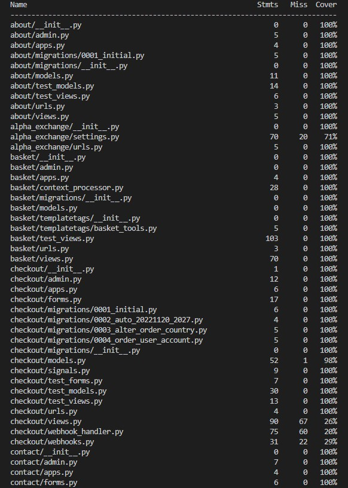<br>
<br>

</details>

[Back to Table Of Content](#table-of-content)

## Bugs
| **Bug** | **Fix** |
| ------- | ------- |
| Issues with loading the filtered query page search along with pagination | Re-write views and used django-filters package as per guides detailed below. |
| Issues with too many GET requests from AWS servers | Added database_url to env.py by mistake, removed to stop linking to postgres database during development. |
| Category filtering not working using query filtering | Used category view to filter the products directly. |
| Django self updated to version 4.2 when preparing to deploy to heroku due to another library and also installed backports.zoneinfo | Rolled back Django to 3.2 for version support and uninstalled backports.zoneinfo |
|  |  |

[Back to Table Of Content](#table-of-content)

## Google emails
To set up the project to send emails and to use a Google account as an SMTP server, the following steps are required
1. Create an email account at google.com, login, navigate to Settings in your gmail account and then click on Other Google Account Settings
2. Turn on 2-step verification and follow the steps to enable
3. Click on app passwords, select Other as the app and give the password a name, for example Django
<br>
4. Click create and a 16 digit password will be generated, note the password down
5. In the env.py file, create an environment variable called EMAIL_HOST_PASS with the 16 digit password
6. In the env.py file, create an environment variable called EMAIL_HOST_USER with the email address of the gmail account
7. Set and confirm the following values in the settings.py file to successfully send emails
<br><code>EMAIL_BACKEND = 'django.core.mail.backends.smtp.EmailBackend'</code>
<br><code>EMAIL_USE_TLS = True</code>
<br><code>EMAIL_PORT = 587</code>
<br><code>EMAIL_HOST = 'smtp.gmail.com'</code>
<br><code>EMAIL_HOST_USER = os.environ.get('EMAIL_HOST_USER')</code>
<br><code>EMAIL_HOST_PASSWORD = os.environ.get('EMAIL_HOST_PASS')</code>
<br><code>DEFAULT_FROM_EMAIL = os.environ.get('EMAIL_HOST_USER')</code>
8. You will also need to set the variables EMAIL_HOST_PASS and EMAIL_HOST_USER in your production instance, for example Heroku

[Back to Table Of Content](#table-of-content)

## Stripe
1. Register for an account at stripe.com
2. Click on the Developers section of your account once logged in
3. Under Developers, click on the API keys section
<br>
4. Note the values for the publishable and secret keys
5. In your local environment(env.py) and heroku, create environment variables STRIPE_PUBLIC_KEY and STRIPE_SECRET_KEY with the publishable and secret key values
<br><code>os.environ.setdefault('STRIPE_PUBLIC_KEY', 'YOUR_VALUE_GOES_HERE')</code>
<br><code>os.environ.setdefault('STRIPE_SECRET_KEY', 'YOUR_VALUE_GOES_HERE')</code>
6. Back in the Developers section of your stripe account click on Webhooks
7. Create a webhook with the url of your website <url>/checkout/wh/, for example: https://alpha-exchange.herokuapp.com/checkout/wh/
8. Select the payment_intent.payment_failed and payment_intent.succeeded as events to send
<br>
9. Note the key created for this webhook
10. In your local environment(env.py) and heroku, create environment variable STRIPE_WH_SECRET with the secret values
<code>os.environ.setdefault('STRIPE_WH_SECRET', 'YOUR_VALUE_GOES_HERE')</code>
11. Feel free to test out the webhook and note the success/fail attempts for troubleshooting

[Back to Table Of Content](#table-of-content)

## Deployment

### Amazon WebServices
1. Create an account at aws.amazon.com
2. Open the S3 application and create a new S3 bucket  with a globally unique name mine is "pp5-alpha-exchange"
3. Uncheck the "Block All Public access setting"
4. In the Properties section, navigate to the "Static Website Hosting" section and click edit
5. Enable the setting, and set the index.html and the error.html values
<br>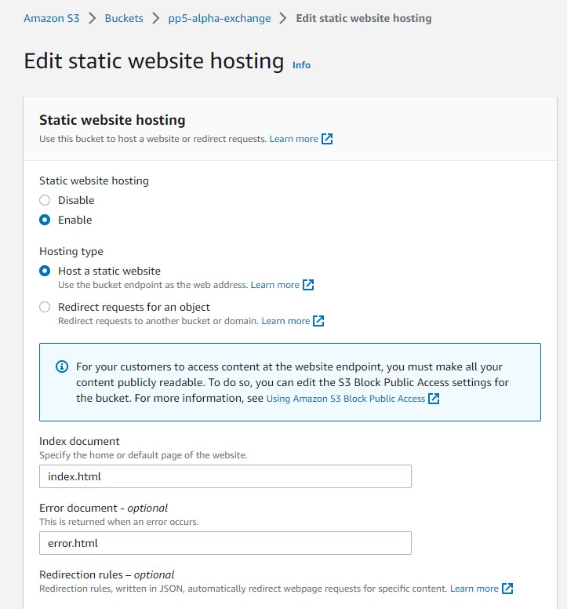
6. In the Permissions section, click edit on the CORS configuration and set the below configuration
<br>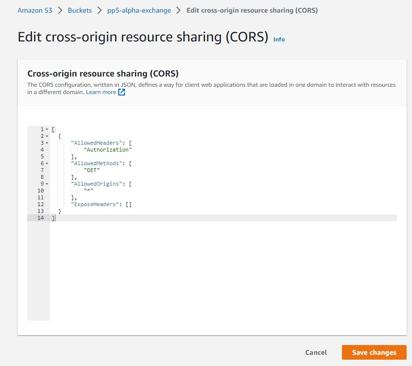
7. In the permissions section, click edit on the bucket policy and generate and set the below configuration(or similar to your settings)
<br>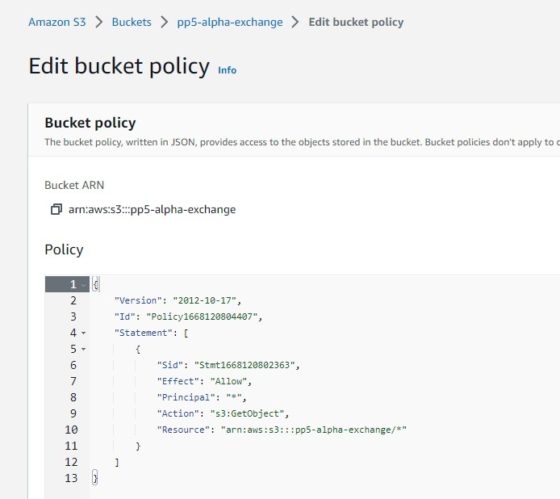
8. In the permissions section, click edit on the Access control list(ACL)
9. Set Read access for the Bucket ACL for Everyone(Public Access)
10. The bucket is created, the next step is to open the IAM application to set up access
11. Create a new user group named "manage-alpha-exchange"
12. Add the "AmazonS3FullAccess" policy permission for the user group
13. Go to "Policies" and click "Create New Policy"
14. Click "Import Managed Policy" and select "AmazonS3FullAccess" > Click 'Import'.
15. In the JSON editor, update the policy "Resource" to the following
<br><code>"Resource": [</code>
<br><code>"arn:aws:s3:::pp5-alpha-exchange",</code>
<br><code>"arn:aws:s3:::pp5-alpha-exchange/*"</code>
<br><code>]</code>
16. Give the policy a name and click "Create Policy"
17. Add the newly created policy to the user group
<br>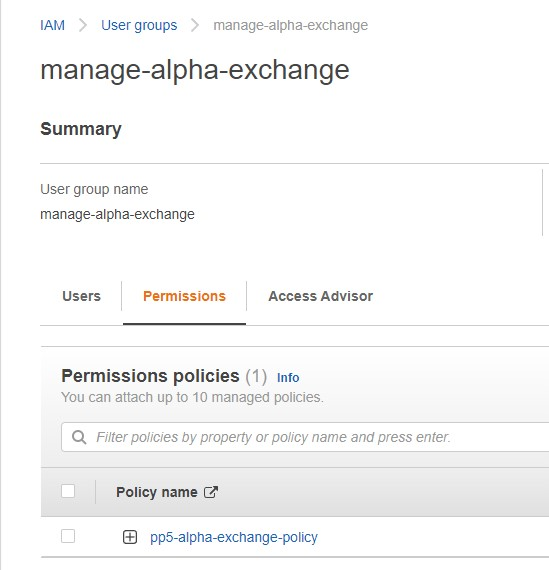
18. Go to Users and create a new user
19. Add the user to the user group manage-alpha-exchange
20. Select "Programmatic access" for the access type
21. Note the AWS_SECRET_ACCESS_KEY and AWS_ACCESS_KEY_ID variables, they are used in other parts of this README for local deployment and Heroku setup
22. The user is now created with the correct user group and policy
<br>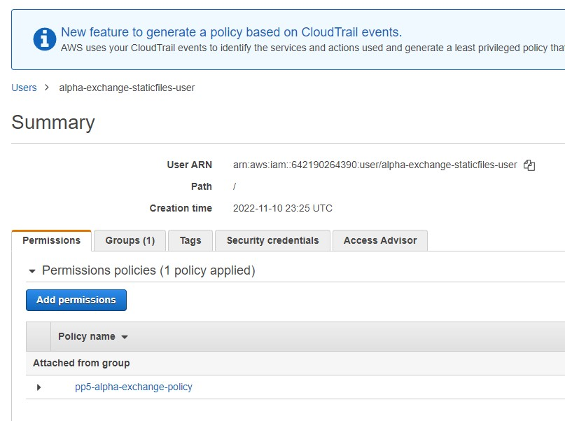
23. Note the AWS code in settings.py. Note an environment variable called USE_AWS must be set to use these settings, otherwise it will use local storage
<br>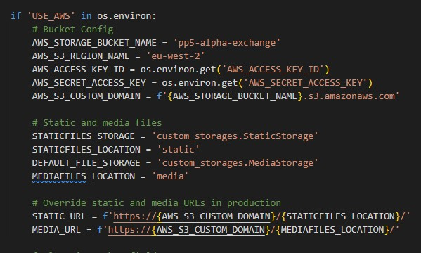
24. These settings set up a cache policy, set the bucket name, and the environment variables AWS_ACCESS_KEY_ID and AWS_SECRET_ACCESS_KEY that you set in your aws account
25. The configuration also requires the media/static folders that must be setup in the AWS S3 bucket to store the media and static files 

### Heroku
This application has been deployed from GitHub to Heroku by following the steps:

1. Create or log in to your account at heroku.com
2. Create a new app, add a unique app name (this project is named "alpha-exchange") and choose your region
3. Click on create app
4. Under resources search for postgres, and add a Postgres database to the app
5. Install the plugins dj-database-url and psycopg2-binary
6. Install django and gunicorn
7. Add the list of requirements by writing in the terminal "pip3 freeze --local > requirements.txt"
8. Create a Procfile in your app: 
   ```
   wsgi:PROJECT_NAME.wsgi
   ```
   (web: gunicorn alpha_exchange.wsgi)
9. In the setting.py file ensure you have connected to the Heroku postgres database
10. Ensure Debug is set to False in the settings.py file
11. Add localhost/127.0.0.1, and alpha-exchange.herokuapp.com to the ALLOWED_HOSTS variable in settings.py
12. Go to Settings in your Heroku and set the environment variables in the Config Vars
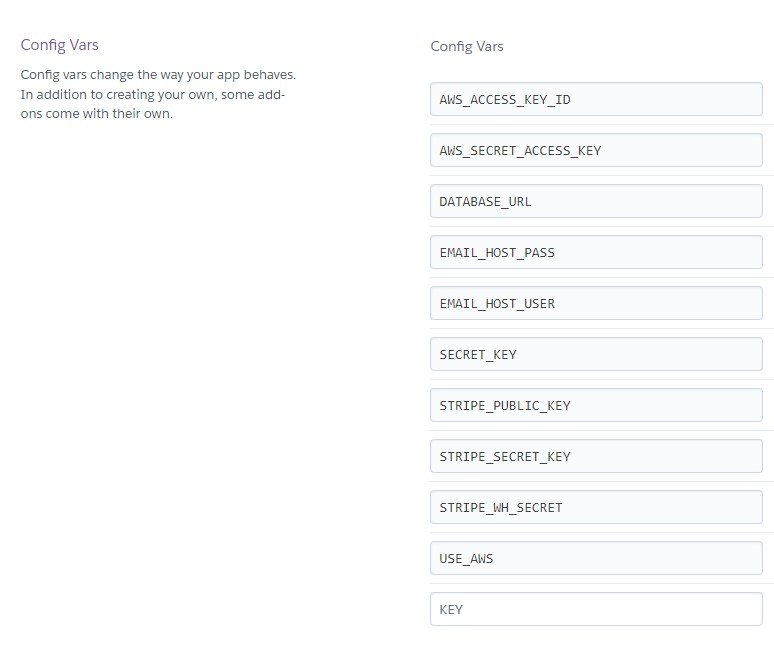
13. Remove DISABLE_COLLECTSTATIC from Heroku settings
14. Push the code to Heroku using the command git push heroku main

Final Steps:
1. Go to "Deploy" in the menu bar on the top
2. Select the deployment method Github
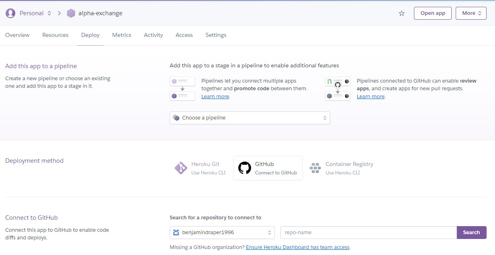
3. Search for the name of the Github Repository and connect
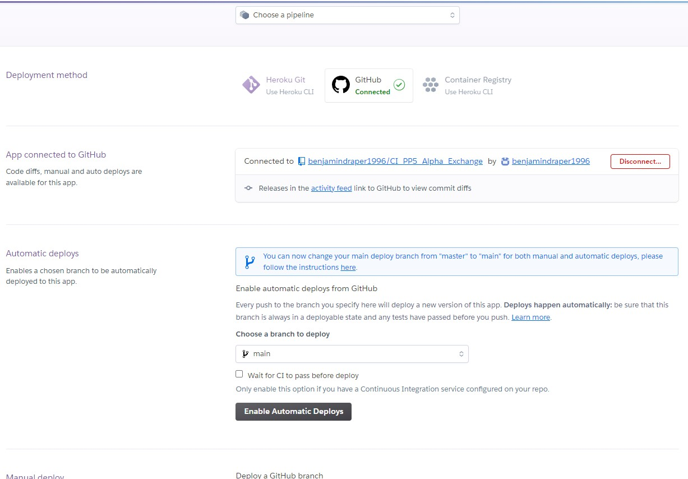
4. Scroll down and enable automatic deployment
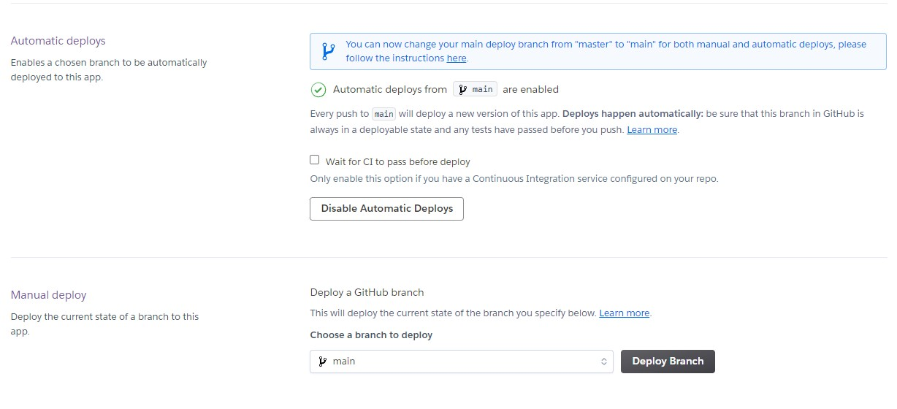

### Forking the GitHub Repository
1. Go to the GitHub repository
2. Click on Fork button in top right corner
3. You will then have a copy of the repository in your own GitHub account.
   
### Making a Local Clone
1. Go to the GitHub repository 
2. Locate the Code button above the list of files and click it
3. Highlight the "HTTPS" button to clone with HTTPS and copy the link
4. Open Git Bash
5. Change the current working directory to the one where you want the cloned directory
6. Type git clone and paste the URL from the clipboard ($ git clone <span>https://</span>github.com/YOUR-USERNAME/YOUR-REPOSITORY)
7. Press Enter to create your local clone

[Back to Table Of Content](#table-of-content)

## Credits
### Media
All of the media featured on the website is not owned by the developer. 

Any further recipes and images added by third parties and individuals have been obtained by the third party.

| **Link to Asset** | **Created By** | **Web Source** |
| ----------------- | -------------- | -------------- |
| [shopping-cart.webp](/media/shopping-cart.webp) | [Alexas_Fotos](https://pixabay.com/users/alexas_fotos-686414/) | [Pixabay](https://pixabay.com/photos/shopping-business-retail-trade-1165437/) |
| [Favicon](/static/img/favicon_io/android-chrome-512x512.png) | [emirkhan bal](https://www.pexels.com/@emirkhan-bal-221704/) | [Pexels](https://www.pexels.com/photo/gray-and-blue-stainless-steel-shopping-cart-953862/) |
| [Categories](/products/fixtures/categories.json) | Mirroring the CI Boutique Ado fixtures, I updated these to fit my needs with new information pruned from a new Kaggle dataset. | [Kaggle](https://www.kaggle.com/datasets/paramaggarwal/fashion-product-images-small) |
| [Products](/products/fixtures/products.json) | Mirroring the CI Boutique Ado fixtures, i updated these to fit my needs with new information pruned from a new Kaggle dataset. | [Kaggle](https://www.kaggle.com/datasets/paramaggarwal/fashion-product-images-small) |
| Product Images | Pruned from the kaggle dataset to match the product details in the fixtures, these were then renamed for accessibility reasons. | [Kaggle](https://www.kaggle.com/datasets/paramaggarwal/fashion-product-images-small) |
|  |  |  |
|  |  |  |

### Code
- The Django All-Auth code and webpages were used from the Django blog project and then customized for this project.
- The card design was based upon a guide found [HERE](https://www.youtube.com/watch?v=5DEq5cWNYt8&ab_channel=KevinPowell) by Kevin Powell on youtube, this was adapted to fit my use case.
- The pagination code used was referenced both from the CI course material and this blog post found [HERE](https://dontrepeatyourself.org/post/django-pagination-with-function-based-view/) 

- A massive thank you to [dannymagnus](https://github.com/dannymagnus) and [Aleksandra_alumna](https://code-institute-room.slack.com/archives/C010RUUFGDQ/p1650997281601259?thread_ts=1650970836.247149&cid=C010RUUFGDQ) on Github who's project and post on slack respectively, these two pointed me towards posts and examples to help fix my bugs with pagination and sorting/filtering my products. These resources can be found on a [Youtube Video](https://www.youtube.com/watch?v=dkJ3uqkdCcY&t=1138s&ab_channel=TauhidCodes), on a blog [post](https://simpleisbetterthancomplex.com/snippet/2016/08/22/dealing-with-querystring-parameters.html), and [stackoverflow post](https://stackoverflow.com/questions/47996963/that-page-number-is-less-than-1-django).

[Back to Table Of Content](#table-of-content)

## Acknowledgements

I would like to take the opportunity to thank:
- My mentor Mo Shami, for his professional feedback, advice, guidance, and support.
- My partner Megan Fox, for her support advice, help testing, inspiration for the project and allowing me the time to work on my project.
- To the Code Institute Slack community for providing help and support.

[Back to Table Of Content](#table-of-content)